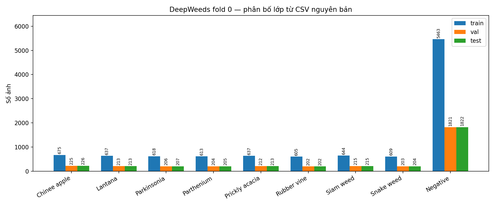
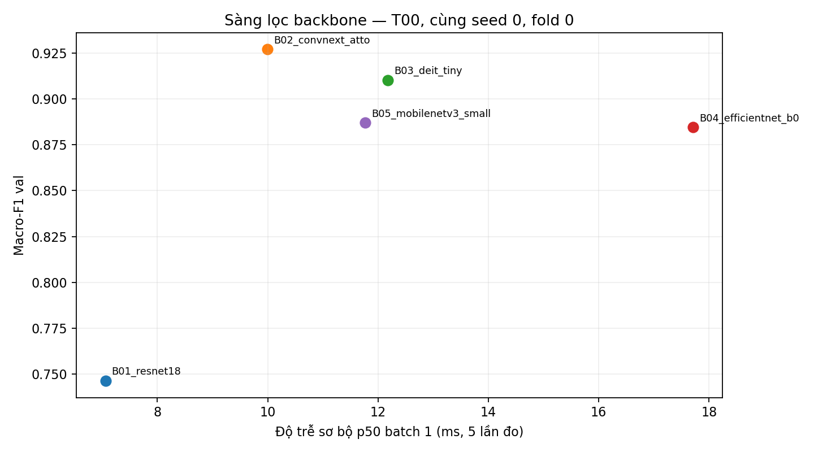
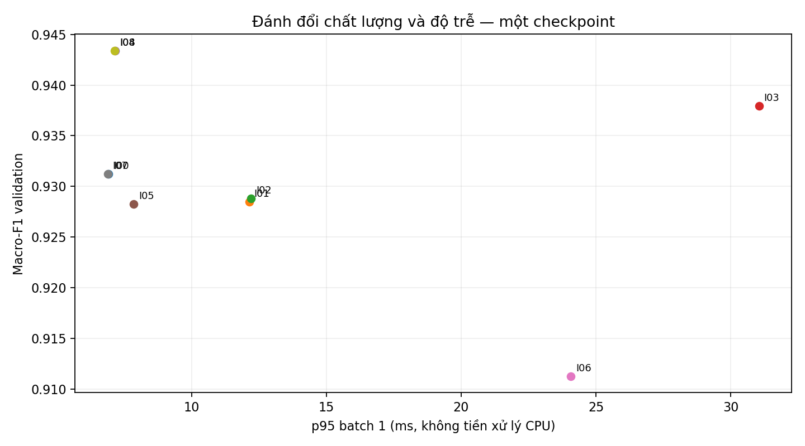
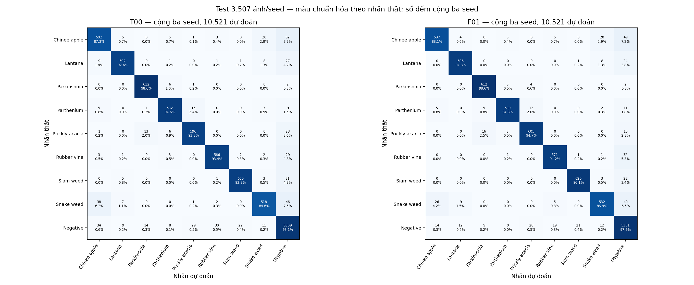
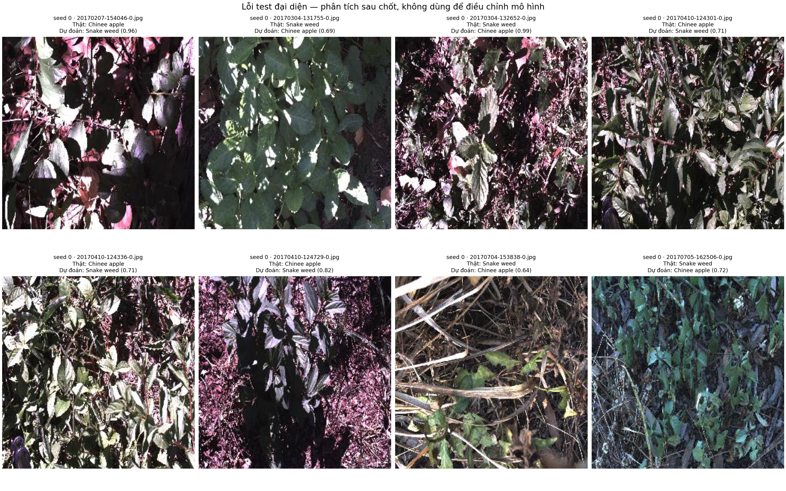

# Lab Day 2 — Nhận dạng cỏ dại DeepWeeds

**Đào Gia Bảo · MSSV 2A202602793**
Fold 0 nguyên bản · Apple M4/MPS · 19 lượt huấn luyện thật, 190 epoch.

## 1. Tóm tắt

Phân loại chín lớp với macro-F1 làm chỉ số chính để tránh thiên lệch của lớp Negative.
Đã so sánh năm họ backbone, tám công thức huấn luyện và chín cấu hình suy luận trên validation.
Chọn ConvNeXt-Atto tiền huấn luyện, tinh chỉnh toàn bộ với label smoothing 0,1, train 128 và suy luận một view 160.
Temperature scaling khớp NLL validation riêng mỗi seed; cấu hình được commit trước test.
Chung kết F01 và mốc T00 đều được huấn luyện mới với seed 0/1/2, mỗi seed test đúng một lượt đủ 3.507 ảnh.
F01 test macro-F1 **0.9451 ± 0.0036**, top-1 **0.9575 ± 0.0030**; mốc macro-F1 **0.9325 ± 0.0051**.
Delta ghép seed **+0.0125 ± 0.0026**, lớn hơn std từng nhóm nhưng mới có ba seed và một fold.
ECE test giảm **0.0856 → 0.0087**; p95 thành phần suy luận **14.72 ms** trên M4, chưa phải độ trễ camera/robot hoàn chỉnh.

## 2. Dữ liệu và thiết lập thực nghiệm

### Dữ liệu, phân bố và kiểm tra

DeepWeeds có 17.509 ảnh: **10.501 train, 3.501 val, 3.507 test** theo CSV fold 0. Giao ba tập rỗng theo tên, hợp đủ dữ liệu, không thiếu ảnh. Không tự chia lại, không loại mẫu, không dùng test để chọn mô hình. ZIP được kiểm tra MD5 trước giải nén. CSV nguồn và hash được giữ trong bằng chứng.

Negative có 9.106 ảnh, chiếm **52,01%**, tỷ số lớp lớn nhất/nhỏ nhất khoảng **9,02**. Nguồn `labels.csv` có số lượng tám loài lần lượt 1.125, 1.064, 1.031, 1.022, 1.062, 1.009, 1.074, 1.016. Có một sai khác annotation: `20170714-110407-3.jpg` ghi lớp 0 trong train nhưng lớp 1 trong `labels.csv`. Giữ nhãn split nguyên bản; do đó đếm theo hợp split cho lớp 0/1 là 1.126/1.063. Đây là sai khác nguồn được báo cáo, không sửa nhãn sau khi xem kết quả.

EDA xem ít nhất ba ảnh **train** mỗi lớp ([gallery](evidence/class_samples.png)); toàn bộ ảnh train là RGB 256×256. Các loài có lá/cành tương tự và nền cây dày đặc; Negative là tập nền đa dạng, không phải ảnh trống. Macro-F1 trung bình đều chín lớp, top-1, balanced accuracy và precision/recall/F1 từng lớp theo `eval.py` nguyên bản. ECE dùng 15 bin. Mean ± std là **sample std ddof=1**, không phải khoảng tin cậy hay sai số chuẩn.

### Công thức chung và phần cứng

Apple M4, RAM 16 GiB, macOS ARM64; Python 3.12.7, torch 2.6.0, torchvision 0.21.0, timm 1.0.22. CUDA không khả dụng. Mọi thí nghiệm chất lượng dùng **FP32 trên MPS**, không tuyên bố lợi ích AMP/FP16. Theo ngân sách GUIDE, thống nhất 10 epoch, batch 32 và train 128×128 cho tất cả backbone; mẫu thăm dò chi phí trong `evidence/compute_probe.csv` không được gọi là latency triển khai.

Train dùng RandomResizedCrop + horizontal flip, mean/std ImageNet; val/test resize `int(size/0.875)` rồi center crop bicubic. AdamW LR backbone/head **1e-4/1e-3**, WD **0,05**, norm/bias không decay; warmup một epoch rồi cosine theo iteration. Head mới của tất cả model dùng normal(std=0,01), bias=0. Checkpoint chọn macro-F1 toàn bộ val ở độ phân giải train, hòa giữ epoch sớm hơn. Train shuffle/drop_last để đủ batch; mỗi epoch 10.496 ảnh được xử lý, năm ảnh cuối thay đổi theo shuffle, không xóa khỏi dataset. Val/test không shuffle và không drop_last.

Seed cố định Python/NumPy/torch/MPS và worker/generator DataLoader. Deterministic algorithms dùng warn_only; không bảo đảm từng bit trên phần cứng/backend khác. Resume giữ RNG, optimizer, scheduler, scaler và generator. Kiểm tra một batch ban đầu phát hiện head MobileNet có CE 7,60; sửa khởi tạo chung trước thực nghiệm, CE mới 2,35 và quá khớp đạt loss 0,0119/accuracy 100%. Traceback và kiểm tra CPU/MPS giữ trong `evidence/`, không che lần hỏng.

## 3. So sánh backbone

| ID | Tag timm | Tham số M | GMAC | F1 val | Top-1 val | Train/epoch s | p50 sơ bộ ms |
|---|---|---|---|---|---|---|---|
| B01_resnet18 | resnet18.a1_in1k | 11.1811 | 0.5922 | 0.7461 | 0.8112 | 49.94 | 7.06 |
| B02_convnext_atto | convnext_atto.d2_in1k | 3.3774 | 0.1786 | 0.9271 | 0.9460 | 48.45 | 9.99 |
| B03_deit_tiny | deit_tiny_patch16_224.fb_in1k | 5.5008 | 0.3545 | 0.9102 | 0.9346 | 64.46 | 12.17 |
| B04_efficientnet_b0 | efficientnet_b0.ra_in1k | 4.0191 | 0.1260 | 0.8846 | 0.9129 | 91.00 | 17.71 |
| B05_mobilenetv3_small | mobilenetv3_small_100.lamb_in1k | 1.5271 | 0.0188 | 0.8870 | 0.9160 | 47.83 | 11.77 |

ResNet, ConvNeXt, transformer DeiT và hai mạng nhẹ đều chạy cùng công thức, seed 0, đủ mười epoch. ConvNeXt-Atto có F1 val cao nhất **0,9271**, so với DeiT-Tiny 0,9102 và ResNet-18 0,7461. Đây là sàng lọc **một seed**, chưa xác nhận độ ổn định thứ hạng giữa các backbone. Các tag ImageNet khác công thức tiền huấn luyện upstream; không tách được tác động thuần kiến trúc khỏi chất lượng trọng số nguồn.

GMAC là số đo toán tử được torch FLOP counter hỗ trợ rồi chia hai, không tính đầy đủ mọi normalization/activation. MobileNet có GMAC thấp nhất nhưng p50 không thấp nhất: GMAC không thay cho latency thực tế của kernel/backend. Độ trễ bảng backbone chỉ **10 warmup/5 mẫu**, phục vụ sàng lọc; benchmark chính thức ở mục 5 dùng 50 mẫu. Thời gian train/epoch không gồm val/ghi checkpoint; bảng workbook có thêm cột train+val. Không so trực tiếp thời gian backbone với ablation như hiệu ứng siêu tham số vì truy cập Dataset đã được tối ưu tương đương giữa hai giai đoạn.

## 4. Ablation công thức huấn luyện

Giữ ConvNeXt-Atto và công thức nền. Kế hoạch được ghi trước: A gồm finetune/frozen/scratch; B gồm basic/ColorJitter/CutMix; C gồm CE/label smoothing/focal. T07 là kết hợp hai trục đã khai báo, nhằm kiểm tra tương tác dù CutMix đơn lẻ không tăng điểm.

| ID | Trục | Thay đổi | F1 val | Δ so T00 | F1 Chinee | F1 Snake | ECE val |
|---|---|---|---|---|---|---|---|
| T00_screen | Mốc | Không đổi | 0.9271 | +0.0000 | 0.8547 | 0.8675 | 0.0126 |
| T01_frozen | A | Đóng băng backbone | 0.5954 | -0.3317 | 0.5297 | 0.4800 | 0.0360 |
| T02_scratch | A | Khởi tạo ngẫu nhiên | 0.2106 | -0.7165 | 0.2278 | 0.0360 | 0.0283 |
| T03_color | B | Thêm ColorJitter | 0.9236 | -0.0035 | 0.8786 | 0.8601 | 0.0095 |
| T04_cutmix | B | Thêm CutMix alpha=1 | 0.9198 | -0.0073 | 0.8318 | 0.8657 | 0.0386 |
| T05_ls | C | Label smoothing epsilon=0,1 | 0.9312 | +0.0042 | 0.8671 | 0.8718 | 0.0869 |
| T06_focal | C | Focal gamma=2 | 0.9191 | -0.0080 | 0.8384 | 0.8468 | 0.0731 |
| T07_cutmix_ls | B+C | CutMix alpha=1 + label smoothing 0,1 | 0.9218 | -0.0053 | 0.8246 | 0.8486 | 0.1168 |

Tinh chỉnh toàn bộ trọng số ImageNet tốt hơn frozen/scratch rõ rệt **trong ngân sách và LR này**. Scratch dùng cùng LR nhỏ dành cho finetune và mười epoch; kết quả thấp không chứng minh scratch không thể học tốt khi được tối ưu riêng. Frozen giữ backbone/BN ở eval, nên sự suy giảm không do vô tình cập nhật thống kê BN.

Label smoothing đạt +0,0042 ở seed sàng lọc nhưng ECE tăng 0,0126 → 0,0869; điểm phân loại và độ tin cậy có thể cải thiện theo hướng khác nhau. Focal/CutMix không cải thiện macro-F1 tại gamma/alpha được thử. ColorJitter delta −0,0035 là nhỏ và chỉ một seed, chưa đủ kết luận tác dụng tổng quát. Giả thuyết CutMix cắt mất cây nhỏ phù hợp một số ảnh, nhưng chưa có phân tích vị trí vật thể để xác nhận.

T07 đạt 0,9218: tăng khoảng 0,0020 so CutMix nhưng thấp hơn LS đơn lẻ 0,0094; hiệu ứng không cộng dồn trong lần sàng lọc. Các chênh nhỏ cần nhiều seed riêng từng ablation, không lấy noise của cấu hình khác làm kiểm định chính thức.

Đường cong T00_screen cho thấy CE train 1,1259 → 0,1191 và F1 val 0,6872 → 0,9271; chưa có suy giảm val rõ ở cuối. T05_ls có F1 tốt nhất epoch9 (0,9312), epoch10 giảm còn 0,9293 dù val CE giảm; chọn checkpoint theo F1 thay vì loss là cần thiết. Scratch mới đạt 0,2106 ở epoch10 và còn tăng so epoch9, phù hợp hạn chế hội tụ của ngân sách nhỏ. Loss train LS/CutMix khác mục tiêu CE val nên không diễn giải chênh loss tuyệt đối như khoảng quá khớp; train accuracy với mixing không được báo như nhãn cứng.

Sau khi chốt, ba seed ở **cùng inference 128 chưa TS** cho F01/LS là 0.9303 ± 0.0017, T00/CE 0.9288 ± 0.0020. Delta **+0.0016** nhỏ hơn std mỗi nhóm: riêng lợi ích LS **không phân biệt được** từ ba seed này. Chốt LS vẫn được giữ đúng quy trình; không chọn lại sau vòng cuối. Chiến thắng của cấu hình đầy đủ không được quy hết cho loss.

## 5. So sánh phương pháp suy luận

Cùng checkpoint T05_ls seed0, không train lại. Mỗi phương pháp đánh giá toàn bộ val; T được khớp NLL val, không khớp ECE hoặc test. Chọn macro-F1 cao nhất, khi hòa dùng NLL rồi p95. K là số forward view; chi phí tương đối tính p50/I00.

| ID | K | Size | F1 val | ECE val | p50 ms | p95 ms | p99 ms | Ảnh/s b32 | p50/I00 |
|---|---|---|---|---|---|---|---|---|---|
| I00 | 1 | 128 | 0.9312 | 0.0869 | 6.44 | 6.91 | 7.39 | 1792.2 | 1.00 |
| I01 | 2 | 128 | 0.9285 | 0.0877 | 11.78 | 12.13 | 12.73 | 918.7 | 1.83 |
| I02 | 2 | 128 | 0.9288 | 0.0876 | 11.91 | 12.20 | 12.89 | 920.4 | 1.85 |
| I03 | 5 | 128 | 0.9380 | 0.0992 | 29.29 | 31.05 | 32.74 | 377.2 | 4.55 |
| I04 | 1 | 160 | 0.9434 | 0.0876 | 6.86 | 7.15 | 7.47 | 1168.1 | 1.06 |
| I05 | 1 | 224 | 0.9283 | 0.0885 | 7.48 | 7.85 | 8.26 | 618.4 | 1.16 |
| I06 | 3 | 128 | 0.9112 | 0.1045 | 20.28 | 24.07 | 25.64 | 560.8 | 3.15 |
| I07 | 1 | 128 | 0.9312 | 0.0100 | 6.53 | 6.88 | 7.14 | 1801.0 | 1.01 |
| I08 | 1 | 160 | 0.9434 | 0.0133 | 6.82 | 7.14 | 7.54 | 1164.9 | 1.06 |

I01/I02 hflip trung bình prob/logit giảm nhẹ điểm và tăng p50 khoảng 1,83–1,85 lần. I03 năm crop tăng F1 +0,0067 nhưng tốn **4,55 lần** p50. I04 một view 160 tăng **+0,0122**, lớn hơn lợi ích crop với chi phí chỉ 1,06 lần trong phiên đo sàng lọc. Tăng tiếp lên 224 không giúp; kích thước kiểm tra cần lựa chọn bằng val, không mặc định càng lớn càng tốt.

I06 gộp ba scale 96/128/160 của tensor đã chuẩn hóa 128, nên scale lớn không phục hồi chi tiết ảnh gốc. Nó giảm F1 và tốn 3,15 lần p50. PyTorch 2.6 MPS không hỗ trợ bicubic antialias tensor interpolation ở lần thử ban đầu. Chuyển toàn bộ multi-scale sang **bilinear không antialias**, kiểm tra backend rồi chạy lại toàn bộ suite trước chốt; traceback giữ trong bằng chứng. Không sử dụng CPU fallback ngầm.

I07 hiệu chuẩn I00; I08 hiệu chuẩn I04 tốt nhất theo F1. Với I04/I08, T=0,6325 làm ECE val **0,0876 → 0,0133**, NLL **0,2097 → 0,1384**, macro-F1/top-1 giữ nguyên vì temperature dương không đổi argmax. T<1 tăng độ sắc xác suất, phù hợp đầu ra LS đang thiếu tự tin trên val; không mặc định TS luôn làm mềm xác suất.

Benchmark dùng 10 warmup và **50 lần có đồng bộ MPS trước/sau timer**, FP32, batch 1 và riêng batch 32. Bao gồm view transform, forward, aggregation và temperature/softmax trên tensor GPU. **Không gồm đọc ảnh, resize/normalize CPU, truyền camera hoặc điều khiển robot**. ConvNeXt dùng LayerNorm, không có Conv-BN để fusion; utility fusion đã kiểm tra riêng, không báo tăng tốc giả. EMA, ensemble, FP16 có API/kiểm tra kỹ thuật nhưng chưa thực nghiệm chất lượng; không có dòng số đo cho các kỹ thuật đó.

## 6. Cấu hình chung kết, test và phân tích lỗi

### Cấu hình có thể tái lập

`F01`: ConvNeXt-Atto `d2_in1k`, tinh chỉnh toàn bộ, train128, crop+flip, **LS ε=0,1**, 10 epoch/batch32, AdamW/warmup+cos như mục 2, FP32, không EMA/mixing. Infer resize182→center crop160, một view K=1, TS khớp riêng val mỗi seed. Nhiệt độ seed0/1/2 là **0,632519 / 0,663577 / 0,653593**; checkpoint epoch **9/10/10**. `T00`: cùng backbone/optimizer/train, loss CE, infer resize146→crop128, T=1; checkpoint epoch10 cả ba seed.

Snapshot tiền huấn luyện ConvNeXt **435c0a8d02d5b872e90c8cde36887465982cb399**, SHA-256 **0f70bc49f1896c8c15af857d2d1d418abfaf097a62b4e29a35e6e65b752f5953**. `configs/frozen_final.json` commit **1629d9e** trước vòng cuối/test; giữ nguyên sau test. Cache toàn cục mất trước T00 seed0; utility khôi phục đúng snapshot/SHA sang cache riêng, không thay nguồn. Bản sửa cờ xuất test ở **6c07c9f** diễn ra trước mọi test, chỉ bỏ cờ runtime khỏi kiểm tra cache bất biến; fingerprint các hàm toán học không đổi ([bằng chứng](evidence/pretest_runtime_fix.md)).

| ID | F1 val mean±std | F1 test mean±std | Top-1 test | ECE test | NLL test |
|---|---|---|---|---|---|
| T00 | 0.9288 ± 0.0020 | 0.9325 ± 0.0051 | 0.9478 ± 0.0034 | 0.0108 ± 0.0013 | 0.1636 ± 0.0061 |
| F01 | 0.9447 ± 0.0014 | 0.9451 ± 0.0036 | 0.9575 ± 0.0030 | 0.0087 ± 0.0019 | 0.1490 ± 0.0077 |

| ID | Seed | F1 val | F1 test | Top-1 test | ECE test |
|---|---|---|---|---|---|
| F01 | 0 | 0.9434 | 0.9490 | 0.9609 | 0.0080 |
| F01 | 1 | 0.9462 | 0.9422 | 0.9552 | 0.0073 |
| F01 | 2 | 0.9445 | 0.9439 | 0.9564 | 0.0109 |
| T00 | 0 | 0.9271 | 0.9368 | 0.9507 | 0.0094 |
| T00 | 1 | 0.9310 | 0.9269 | 0.9441 | 0.0113 |
| T00 | 2 | 0.9282 | 0.9339 | 0.9487 | 0.0117 |

Delta test ghép seed lần lượt **+0,01227 / +0,01530 / +0,01002**; mean +0.01253 lớn hơn std baseline 0,00507 và final 0,00355. Dấu cải thiện nhất quán cả ba seed; số seed nhỏ và validation dùng nhiều lần khiến chưa thể khẳng định mọi fold/miền. Chênh mean F1 val/test chỉ 0,00036. Test mỗi seed đủ 3.507 ảnh và ledger chỉ một pass; bản uncal xuất từ cùng logits. ECE test uncal 0.0856 ± 0.0052, sau TS 0.0087 ± 0.0019.

### Từng lớp và ma trận nhầm lẫn

| Lớp | Ảnh/seed | P F01 | R F01 | F1 F01 | Std F1 | R T00 | F1 T00 |
|---|---|---|---|---|---|---|---|
| Chinee apple | 226 | 0.9298 | 0.8805 | 0.9045 | 0.0147 | 0.8732 | 0.8705 |
| Lantana | 213 | 0.9607 | 0.9484 | 0.9543 | 0.0033 | 0.9264 | 0.9412 |
| Parkinsonia | 207 | 0.9533 | 0.9855 | 0.9691 | 0.0022 | 0.9855 | 0.9707 |
| Parthenium | 205 | 0.9831 | 0.9431 | 0.9626 | 0.0027 | 0.9463 | 0.9494 |
| Prickly acacia | 213 | 0.9322 | 0.9468 | 0.9395 | 0.0059 | 0.9327 | 0.9298 |
| Rubber vine | 202 | 0.9517 | 0.9422 | 0.9469 | 0.0075 | 0.9340 | 0.9363 |
| Siam weed | 215 | 0.9643 | 0.9612 | 0.9627 | 0.0073 | 0.9380 | 0.9490 |
| Snake weed | 204 | 0.9208 | 0.8693 | 0.8941 | 0.0094 | 0.8464 | 0.8801 |
| Negative | 1822 | 0.9649 | 0.9790 | 0.9719 | 0.0026 | 0.9713 | 0.9658 |

Snake weed có F1 thấp nhất (0,8941), tiếp theo Chinee apple (0,9045). Recall F01 **88,05%/86,93%**, so với T00 **87,32%/84,64%**; cả hai tăng, nhưng chưa vượt tham khảo bài báo **88,5%/88,8%**. Kết quả tham khảo được cung cấp trong README repo, huấn luyện 100 epoch/augmentation mạnh khác lab mười epoch; không gọi đây là so sánh điều kiện ngang nhau. `eval.py grade` tự chấm mục I **19/20**, là đề xuất để giảng viên xác nhận.

Ma trận cộng ba seed, màu chuẩn hóa hàng: Chinee→Negative **49/678 (7,2%)**, Snake→Negative **40/612 (6,5%)**; Chinee→Snake **20/678 (2,9%)**, Snake→Chinee **26/612 (4,2%)**. Nhiều lỗi lớp khó đi vào Negative hơn cặp 0↔7. Ba seed dùng cùng ảnh, nên 10.521 dự đoán **không phải** 10.521 ảnh độc lập hoặc ensemble.

Gallery được chọn sau khi kết thúc test, ưu tiên lỗi 0↔7, không đại diện tỷ lệ toàn dataset. Quan sát lá/cành chồng lấp, nền dày đặc, bóng tối và vùng sáng mạnh; có ảnh Snake chỉ thấy cây nhỏ giữa cành khô. Đây là giả thuyết thiếu tín hiệu hình thái tại kích thước nhỏ, chưa chứng minh nguyên nhân bằng can thiệp. Ảnh `20170304-132652-0.jpg` vẫn sai với confidence **0,987** sau TS: ECE trung bình thấp không bảo đảm từng mẫu đáng tin. Không sửa nhãn, không điều chỉnh mô hình sau khi xem ảnh lỗi.

## 7. Kết luận và khuyến nghị triển khai

Trong thiết kế này, chọn **F01 một view160 + TS** cho độ chính xác tốt nhất và ứng viên thời gian thực. Benchmark đo lại trên checkpoint F01 seed0 thực tế: **p50 10.27, p95 14.72, p99 18.30 ms**, batch32 **894.6 ảnh/s**. Phiên sàng lọc I08 p95 7,14 ms và phiên chung kết 14,72 ms khác tải/nhiệt/trạng thái backend; dùng số chung kết để khuyến nghị, không chọn số nhỏ thuận lợi. T00 nhanh hơn (p95 10,25 ms) nhưng macro-F1 test thấp hơn 0,0125.

Với ngân sách **30–100 ms/khung**, thành phần GPU của F01 nằm dưới ngân sách, song cần đo cả camera→CPU preprocessing→transfer→GPU→điều khiển trên robot mục tiêu. Không suy ra đạt 30 ms đầu-cuối từ benchmark này. Five-crop p95 31,05 ms đã vượt riêng ngân sách 30 ms và không bằng một view160 về F1 val; không chọn TTA tốn thêm ở đây. Nếu phần cứng robot khác M4 hoặc thiếu ngân sách, T00 là phương án thấp chi phí đã có số đo và ba seed, cần đo lại trên thiết bị.

Đóng góp lớn nhất trong các lựa chọn **đã thử** là chuyển backbone yếu ResNet18 sang ConvNeXt (+0,1809 val, còn bị lẫn công thức pretrained); trong cùng backbone, inference160 (+0,0122 val) rõ hơn LS sàng lọc (+0,0042). Đây là delta theo từng giai đoạn, không phân rã cộng tuyến hay kết luận nhân quả về kiến trúc. Riêng LS ở ba seed/raw128 không vượt nhiễu. TS đóng góp calibration, không đóng góp accuracy.

### Top 10 theo validation — bảng so sánh chính của workbook

| Hạng | ID | Giai đoạn | Seed | F1 val | p50 ms | p95 ms |
|---|---|---|---|---|---|---|
| 1 | F01 | Chung kết val | 3 | 0.9447 | 10.2675 | 14.7225 |
| 2 | I04 | Inference | 1 | 0.9434 | 6.8555 | 7.1489 |
| 3 | I08 | Inference | 1 | 0.9434 | 6.8217 | 7.1432 |
| 4 | I03 | Inference | 1 | 0.9380 | 29.2944 | 31.0520 |
| 5 | T05_ls | Training | 1 | 0.9312 | Chưa đo | Chưa đo |
| 6 | I00 | Inference | 1 | 0.9312 | 6.4397 | 6.9132 |
| 7 | I07 | Inference | 1 | 0.9312 | 6.5277 | 6.8812 |
| 8 | I02 | Inference | 1 | 0.9288 | 11.9062 | 12.2038 |
| 9 | T00 | Chung kết val | 3 | 0.9288 | 9.7153 | 10.2526 |
| 10 | I01 | Inference | 1 | 0.9285 | 11.7815 | 12.1301 |

Ô không có latency là chưa đo riêng, không phải bằng 0. Top10 trộn sàng lọc một seed và mean chung kết ba seed, có cột giai đoạn/số seed để tránh hiểu như xếp hạng cùng độ chắc chắn. F01 val là báo cáo cấu hình đã chốt, không dùng để chọn lại sau test.

## 8. Hạn chế và việc tiếp theo

Một fold, ba seed cho hai cấu hình cuối và một seed cho sàng lọc; chưa đo nhiễu mỗi backbone/ablation. Các ảnh cùng bối cảnh có thể phụ thuộc nhau dù tên file disjoint; chưa kiểm tra chia theo địa điểm/mùa. Mất cân bằng Negative và sai khác annotation nguồn còn giữ nguyên. Train128/mười epoch/batch32 giảm chi phí nhưng hạn chế chi tiết và công bằng đối với mô hình cần huấn luyện lâu.

Không thử tối ưu scratch riêng, class-weight/sampler, lịch LR khác, EMA/ensemble chất lượng, AMP/FP16/INT8 hay test-time adaptation. Utility không thay bằng chứng thực nghiệm. Khớp T trên val cùng miền không đảm bảo calibration khi đổi ánh sáng, mùa hay camera; cần dữ liệu validation mới có nhãn ở miền triển khai, rồi đánh giá trên test mới. Ba seed không đủ suy luận thống kê rộng.

Ưu tiên tiếp theo: lặp thêm seed/fold với thiết kế cố định; phân tích localization/resize cho hai lớp khó; đo robot đầu-cuối và đánh giá miền mới. Các bước này cần một đợt thí nghiệm/test mới, không tiếp tục tối ưu bằng test đã mở. Kết quả hiện tại giữ nguyên để có thể kiểm toán.

## 9. Phụ lục tái lập và bằng chứng

- B01–B05: năm tag trong `tables/Backbones.csv`, cùng `configs/screening_recipe.json`.
- T00_screen–T07: override khai báo trong `configs/training_plan.json`; đầy đủ config mỗi ID/seed trong `logs/`.
- I00–I08: I00 identity128; I01 hflip prob; I02 hflip logit; I03 five-crop128/input160; I04 identity160; I05 identity224; I06 scales96/128/160; I07 TS128; I08 TS160. `tables/Inference.csv` giữ checkpointSHA/K/T/cost, `logs/inference/` giữ 50 mẫu thời gian.
- F01/T00 seed0/1/2: cấu hình bất biến `configs/frozen_final.json`, `final_val.json`, history/checkpointSHA/test_ledger mỗi seed. **19 biểu đồ huấn luyện** trong `curves/`.
- `results.xlsx`: đủ Summary/Backbones/Training/Inference/Final/PerClass/Latency; số đo cố định xuất từ bảng và evaluator, không mô phỏng số liệu.
- `evidence/official_eval/`: stdout score/grade, per-seed/per-class/confusion/summary của evaluator nguyên bản; `evidence/test_passes.json`: sáu ledger một pass.
- [README và lệnh tái lập](README.md); [notebook Colab](https://colab.research.google.com/github/kevindao94work/K4-Track4-Day2-Deeplearning-Advance/blob/main/submissions/2A202602793_dao_gia_bao/code/lab_day2.ipynb).
- Notebook đã kiểm tra cấu trúc/cú pháp, chưa chạy toàn bộ trên Colab. Các số đo báo cáo đến từ CLI trên M4. Dữ liệu/checkpoint không commit; tải lại dữ liệu và train lại qua engine, ghi vào `LAB_OUTPUT_DIR` mới.

Nguồn nội bộ: `GUIDE.md`, `README.md`, `RUBRIC.md`; dữ liệu Zenodo/CSV nguồn do downloader ghi URL/hash. Không lấy con số ước lượng trong hướng dẫn làm kết quả đo.
